# Travel and Geography Quiz

The Travel and Geography Quiz is an interactive, multiple-choice quiz that tests your knowledge of world geography. It offers two difficulty modes: Easy (no timer) and Hard (5-second timer per question), and allows users to track their scores through a leaderboard system.

View the Travel and Geography Quiz [here](https://travel-multiple-choice-58a9427ac1f5.herokuapp.com/)

View the Google Sheets worksheets for the app [here](https://docs.google.com/spreadsheets/d/1cBoLWt-9u3WzgQt5DhBZMV2Vq7SGeH_n4DWf1zMxkio/edit?gid=0#gid=0)

## Table of Contents:
### 1. [UX - User Experience](#1-ux---user-experience)
  - [Project Goals](#project-goals)
  - [User Stories](#user-stories)

### 2. [Features & Future Implementations](#2-features--future-implementations)
  - [Features](#features)
  - [Future Implementations](#future-implementations)

### 3. [Design](#3-design)
  - [App Functionality and Features](#app-functionality-and-features)
  - [Imagery and Colors](#imagery-and-colors)

### 4. [Database](#database)

### 5. [Technologies Used](#5-technologies-used)
  - [Languages Used](#languages-used)
  - [Programs & Tools Used](#programs--tools-used)
  - [Frameworks & Libraries Used](#frameworks--libraries-used)

### 6. [Deployment](#6-deployment)
  - [Deployment on Heroku](#deployment-on-heroku)
  - [Local Development](#local-development)
    - [How to Fork the Repository](#how-to-fork-the-repository)
    - [How to Clone the Repository](#how-to-clone-the-repository)

### 7. [Testing](#7-testing)
  - [Automated Testing](#automated-testing)
  - [Manual Testing](#manual-testing)

### 8. [Bugs](#8-bugs)
  - [Known Bugs](#known-bugs)
  - [Solved Bugs](#solved-bugs)

### 9. [Credits](#credits)

---

## 1. UX - User Experience

### Project Goals
The goal of this project is to create an engaging educational quiz for users who wish to test their knowledge of world geography. The app provides two modes: Easy Mode and Hard Mode, allowing for customization of difficulty. Users can view their scores and compare them on a leaderboard.

### User Stories
- **As a user, I want to choose between different difficulty levels.**
- **As a user, I want to be timed in hard mode to increase the challenge.**
- **As a user, I want to see my score at the end of the quiz.**
- **As a user, I want to compare my score with others on a leaderboard.**

---

## 2. Features & Future Implementations

### Features
- Multiple-choice quiz with randomly shuffled questions.
- Two difficulty levels: Easy (no timer) and Hard (5-second timer).
- Leaderboard system stored in Google Sheets.
- Terminal-based UI with rich formatting and ASCII art.

### Future Implementations
- **More difficulty levels** such as Medium (10-second timer).
- **Category selection** (e.g., landmarks, capitals, natural wonders).
- **More different questions** This ensures the variety of the game and keeps user engaged

---

## 3. Design

### App Functionality and Features
The app has a terminal-based UI that is enhanced using the `rich` library, which provides colorful and formatted text for better readability. It also uses ASCII art for the title screen, making the app feel engaging and visually interesting.

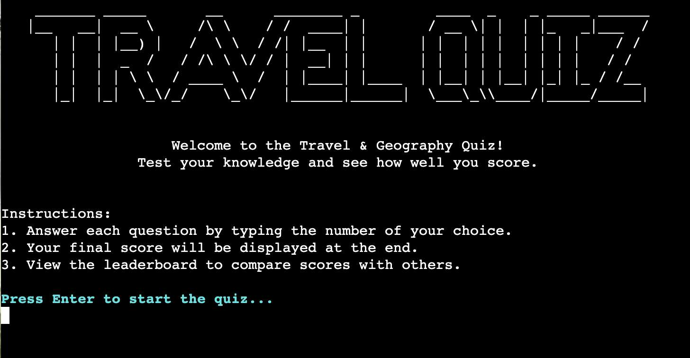
*This screen welcomes the user and provides essential information on how to play the quiz.*

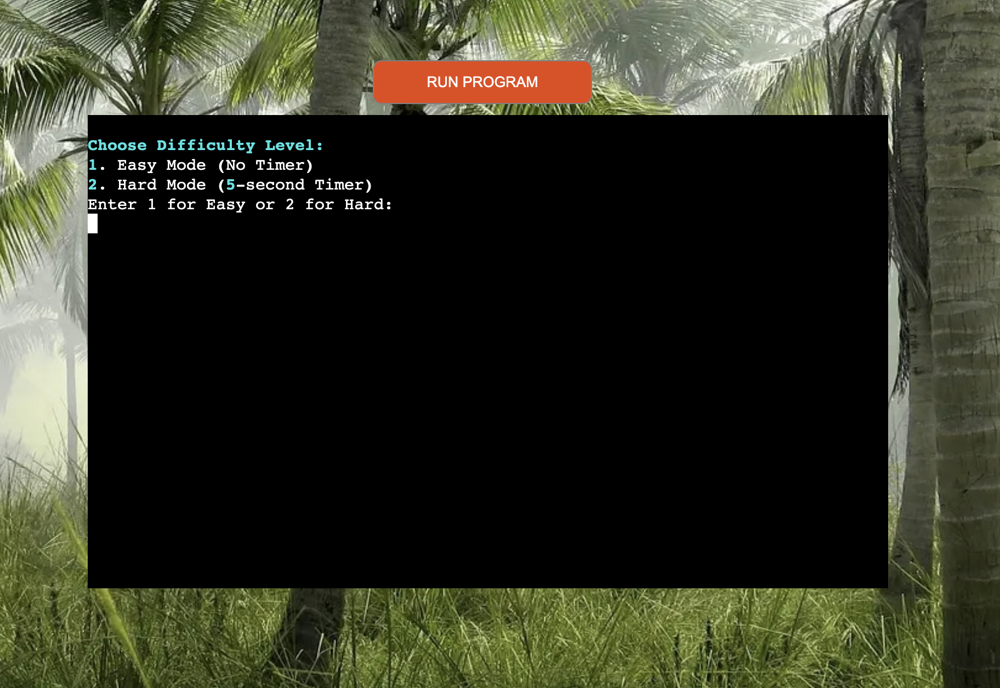  
*The difficulty level selection screen. Here, users can choose between Easy Mode (no timer) or Hard Mode (with a 5-second timer). This screen helps tailor the game experience to different player preferences.*

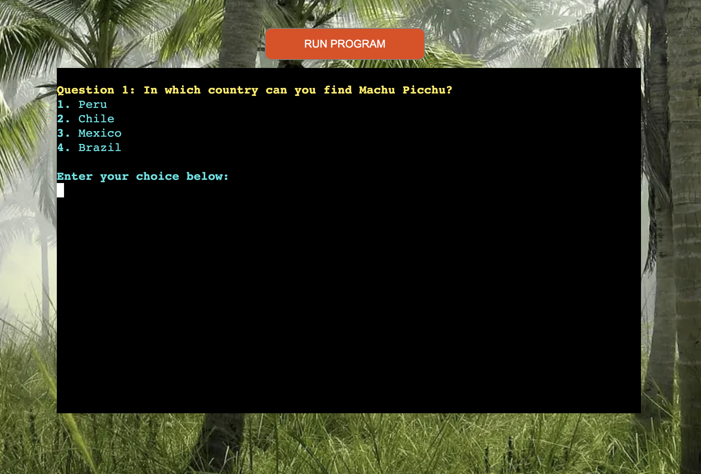
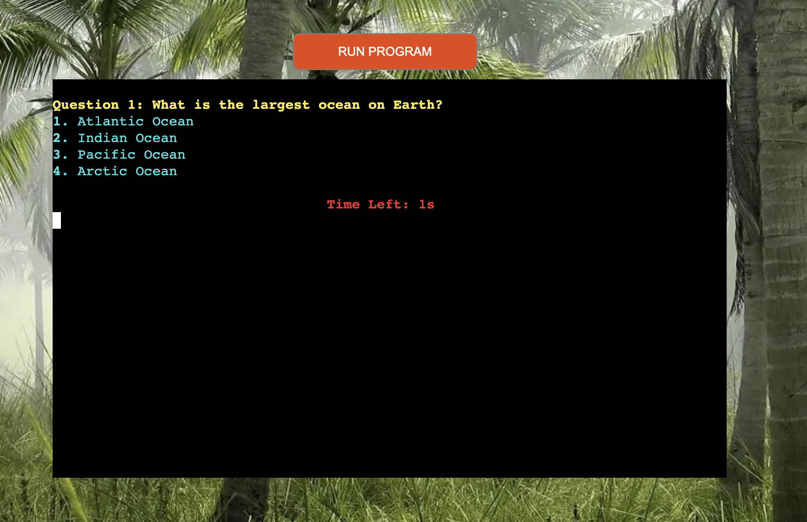  
*The quiz interface displaying the current question, options, and the countdown timer in Hard Mode. This is the core part of the game where users interact with the questions and make their choices.*

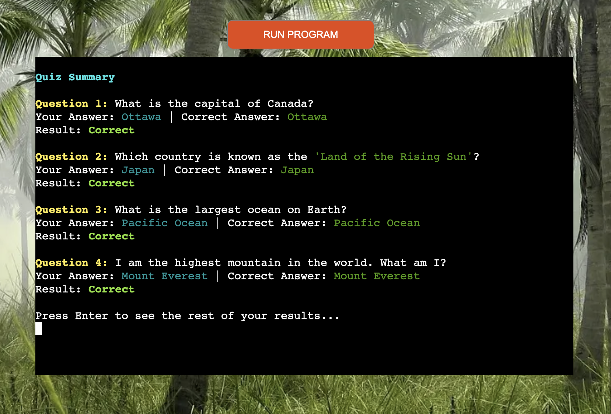  
*The summary screen showing the user's results after completing the quiz. This screen displays the breakdown of correct and incorrect answers, and provides a summary of the quiz performance.*

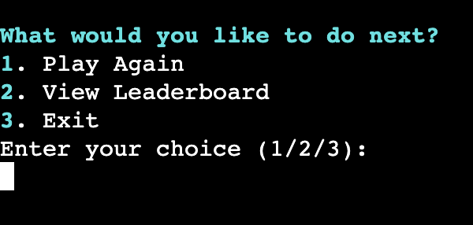  
*The user options screen where users can choose their next action: play the quiz again, view the leaderboard, or exit the game. This allows users to navigate easily and choose what they want to do next.*

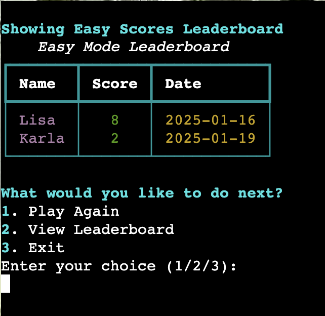  
*The leaderboard screen showing the top scorers in either Easy or Hard mode. Users can check their performance and compare their scores with others.*

### Imagery and Colors
The design uses specific colors to make the UI more readable and visually appealing.

- **Bright Cyan** for the questions: This color makes the questions stand out against the black background, ensuring they are the focal point for the user.
- **Brighter Magenta** for leaderboard names: This color provides contrast and makes the leaderboard entries easily noticeable.
- **Red** for warnings and incorrect answers: The red color is used to draw attention and alert the user about mistakes or critical information.

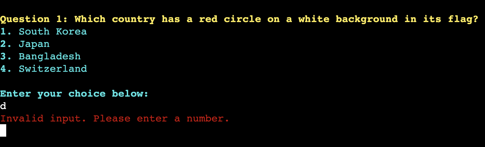 
*This screenshot displays an error message in red when the user makes an invalid selection, such as choosing a non-numeric answer. Red is used to grab the user's attention and indicate that a mistake has been made.*

### Why These Colors?
- **Bright Cyan**: This color helps the user focus on the questions and ensures that the quiz feels lively and engaging.
- **Brighter Magenta**: This color emphasizes important information like leaderboard rankings, making it easy for users to see their score.
- **Red**: Red is used for warnings and errors, ensuring that users understand when they've made a mistake or are running out of time.

---
## 4. Database

The quiz results are stored in a **Google Sheets** document and accessed by the app using the **Google Drive** and **Google Sheets APIs**. The spreadsheet can be viewed [here](https://docs.google.com/spreadsheets/d/1cBoLWt-9u3WzgQt5DhBZMV2Vq7SGeH_n4DWf1zMxkio/edit?gid=0#gid=0).

The spreadsheet consists of the following sheets:

### **Easy Scores**

 

This sheet stores the scores for the Easy Mode quizzes. It includes the player's name, score, and the date the quiz was completed. Any updates to the Easy Mode scores are reflected in real-time as the app writes to the sheet.

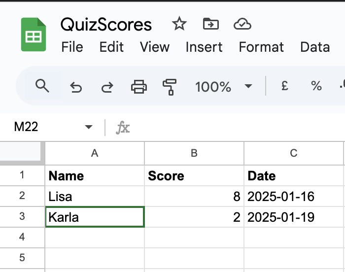  
*Example of the Easy Scores sheet, where users' scores in Easy Mode are recorded.*

### **Hard Scores**

 

This sheet stores the scores for the Hard Mode quizzes. It contains similar data as the Easy Scores sheet, but for users who play with the timer enabled. These scores are also updated in real-time.

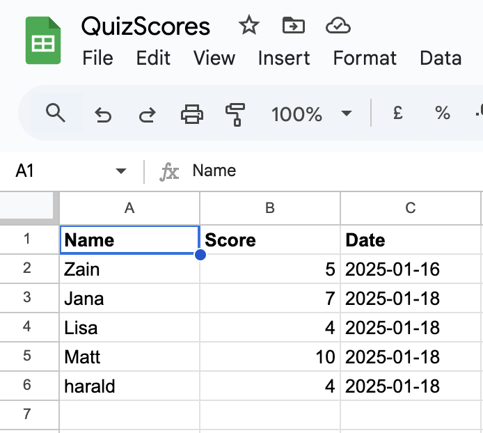  
*Example of the Hard Scores sheet, where users' scores in Hard Mode are recorded.*

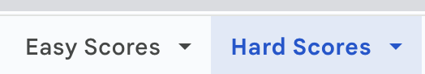 

### **How Data Is Accessed**
The app uses the **Google Sheets API** to read and write data from the Google Sheets document. After each quiz session, the user's name, score, and date are appended to the respective worksheet (either **Easy Scores** or **Hard Scores**). The leaderboard is then dynamically generated by fetching and sorting the data from both sheets, ensuring that the top performers are displayed correctly.

## 5. Technologies Used

### Languages Used
- **Python**

### Programs & Tools Used
- **Git & GitHub**: Version control and repository hosting.
- **Gitpod**: Cloud-based IDE.
- **Heroku**: Deployment platform.
- **PEP8**: Code linting to ensure style consistency.
- **Tinyjpg**: Image optimization.
- **Favicon Generator**: For creating favicons.
- **Canva**: Graphic design tool.
- **ASCII Art Tools**: For terminal-based UI enhancements.
- **Pexels**: Stock images for any necessary visual assets.
- **TechSini**: Mockup generator for UI designs.

### Frameworks & Libraries Used
- **gspread**: For Google Sheets API integration.
- **rich**: For enhanced terminal output formatting.
- **pyfiglet**: For creating ASCII Art titles.
- **black**: Python code formatter.
- **os**: For system commands (e.g., clearing the terminal).
- **threading**: A built-in Python library used for running tasks concurrently, such as managing the countdown timer in Hard Mode without blocking the main program.
- **re**: A library used for working with regular expressions, such as validating user input (e.g., ensuring a name is alphabetic and within a specified length).
- **datetime**: Used for handling and manipulating dates and times, including timestamps for saving quiz results in Google Sheets.

---

## 6. Deployment

### Deployment on Heroku
### 1. Create a Heroku Account
If you don't already have a Heroku account, go to [Heroku](https://id.heroku.com/login) and sign up. Once you have an account, log in.

### 2. Create a New Heroku App
- In the Heroku dashboard, click on the **"New"** button at the top right of the screen.
- Select **"Create new app"**.
- Choose a unique name for your app (e.g., `travel-geography-quiz`), set your region to **Europe** or **United States**, and click **"Create app"**.

### 3. Set Up Config Vars
- Go to the **Settings** tab of your new app.
- Click the **"Reveal Config Vars"** button to set up the environment variables that your app requires, such as API keys.

### 4. Add Configuration Variables
In the "Config Vars" section, add the following key-value pairs:
- **Key**: `CREDS`  
  **Value**: Paste the contents of your `creds.json` file here (this file contains your Google Sheets credentials).
- **Key**: `PORT`  
  **Value**: `8000` (this is the port Heroku uses to run your app).

### 5. Add Buildpacks
- From the **Buildpacks** section, click on the **"Add buildpack"** button.
- First, add **Python** and click **Save changes**.
- Then, add **Node.js** buildpack and click **Save changes** again.
- Ensure **Python** is listed above **Node.js** in the buildpack order. You can rearrange them by dragging the entries if needed.

### 6. Connect GitHub Repository
- In the **Deploy** tab, select **GitHub** as the deployment method.
- Click **"Connect to GitHub"** to link your GitHub repository to Heroku.
- After linking, search for your GitHub repository and click **"Connect"**.

### 7. Deploy the App
You can choose to enable **Automatic Deploys** or deploy manually.
- **Automatic Deploys**: If enabled, Heroku will automatically rebuild the app every time you push new changes to GitHub.
- **Manual Deploy**: If you prefer to deploy manually, you can choose the **"Deploy Branch"** button to trigger a manual deployment.

Once the deployment is finished, Heroku will provide a URL where you can access your deployed app.

### 8. Access Your Deployed App
Once the app is successfully deployed, Heroku will provide a link to your app, e.g., `https://your-app-name.herokuapp.com/`.

### Local Development

#### **How to Fork**
1. Log in to your GitHub account.
2. Navigate to the repository.
3. Click on the **"Fork"** button at the top-right corner of the repository page.
4. A copy of the repository will now appear in your GitHub account under your profile.

#### **How to Clone**
1. Log in to your GitHub account.
2. Navigate to the repository.
3. Click on the green **"Code"** button and choose one of the cloning options:
   - **HTTPS:** Copy the provided link.
   - **SSH:** Use the SSH URL if your GitHub account is set up with SSH keys.
   - **GitHub CLI:** Use the provided CLI command if you have GitHub CLI installed.
4. Open your terminal and navigate to the folder where you want to clone the repository.
5. Type 'git clone' and then paste the URL you copied earlier.
6. Press enter.

---

# **Testing**

 

## **Automated Testing**

### **PEP8 Validation:**

 

I passed my `run.py` file through the [Code Institute Python Linter](https://pep8ci.herokuapp.com/) and no errors were found:

 

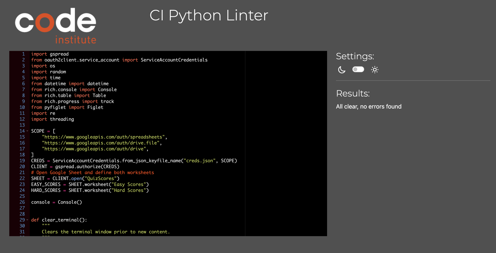  
*This image shows that the `run.py` file passed the PEP8 validation without any issues.*

### **W3C Validator:**

 

To ensure my `layout.html` page was properly formatted, I used the [W3C Markup Validation Service](https://validator.w3.org/). It successfully validated the HTML without any errors or warnings:

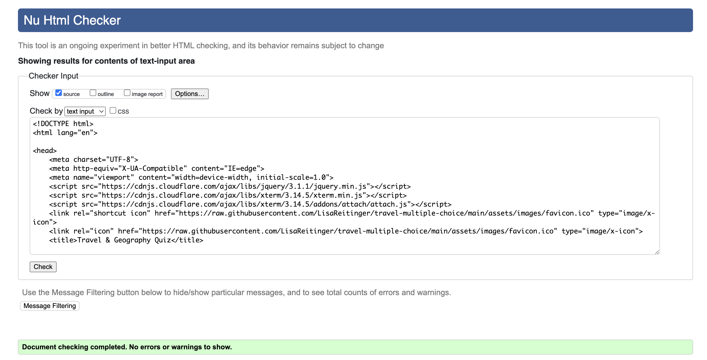  
*Here’s a screenshot showing that the `layout.html` file passed HTML validation with no issues.*

 

Additionally, I used the [W3C Jigsaw CSS Validation Service](https://jigsaw.w3.org/css-validator/) to check the CSS included in the `layout.html` file. The validation passed without errors, ensuring that the CSS is correctly applied:

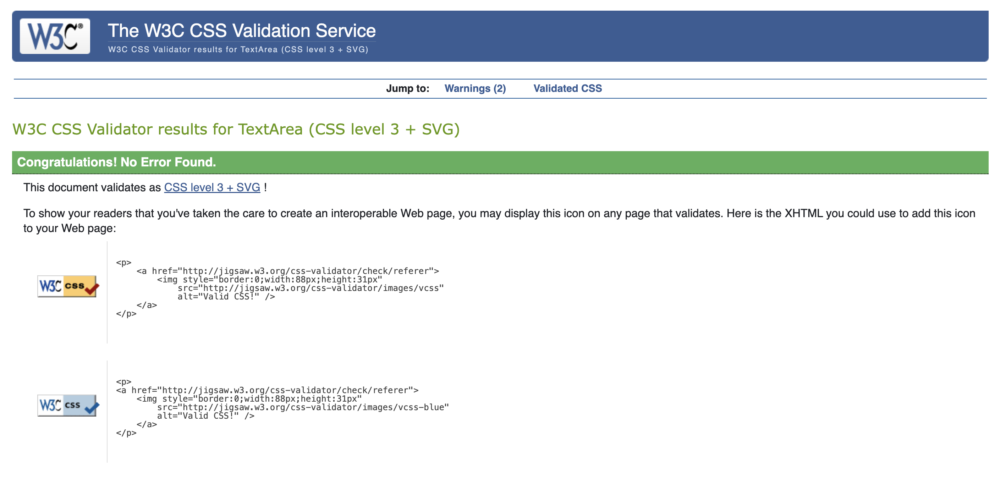  
*This shows the successful CSS validation for the styles used in `layout.html`.*

## **Manual Testing**

 

For manual testing, I performed several tests to ensure the app’s core features and edge cases were handled correctly. Below is a summary of the key areas I tested:

### **Functionality Tests:**
- **Starting the Quiz**: The app initializes properly, and the user is prompted to enter their name and select a difficulty level without any issues.
- **Answering Questions**: Questions are displayed with shuffled answer choices. In **Hard Mode**, the countdown timer works as expected, and the quiz progresses correctly.
- **Completion and Results**: After finishing the quiz, the user's score is displayed, and the results correctly indicate correct and incorrect answers.
- **Leaderboard**: The leaderboard pulls data from Google Sheets and displays scores accurately.

### **Edge Case Testing:**
- **Handling Invalid Inputs**: The app responds well to invalid inputs. If the user enters non-numeric data or selects an invalid answer, an error message is shown, guiding the user to correct their input.
- **Timer in Hard Mode**: When playing in **Hard Mode**, the timer is correctly displayed for each question. The quiz enforces the time limit, preventing users from lingering too long on a question.

---

## 8. Bugs

### Known Bugs
- **Timer Display Issue**: Occasionally, the countdown timer doesn’t display correctly in Hard Mode.
- **Leaderboard Fetch Error**: Sometimes, fetching the leaderboard from Google Sheets results in missing references.

### Solved Bugs
- **Timer Issue**: Fixed the bug where the countdown timer didn’t render properly.
- **Leaderboard Fetch Issue**: Resolved missing sheet reference error and made sure the leaderboard fetches correctly from the Google Sheet.

---

## 9. Credits
- **Mentor Support**: Thanks to my mentor for guidance throughout the development process.
- **Code Institute Tutoring Support**: Appreciation for Code Institute's assistance and resources.

